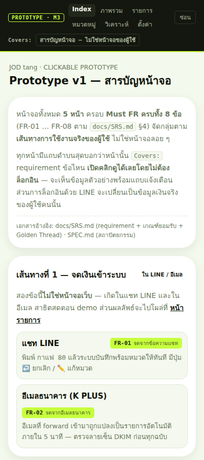
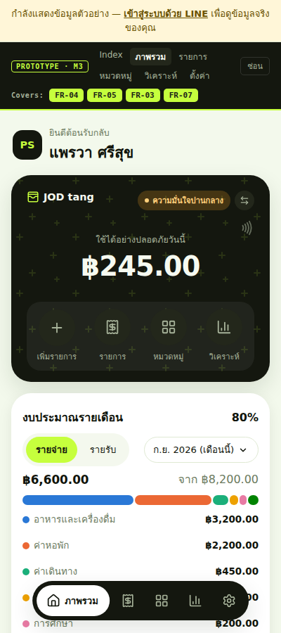
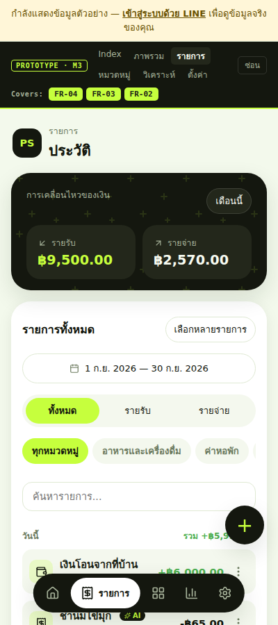
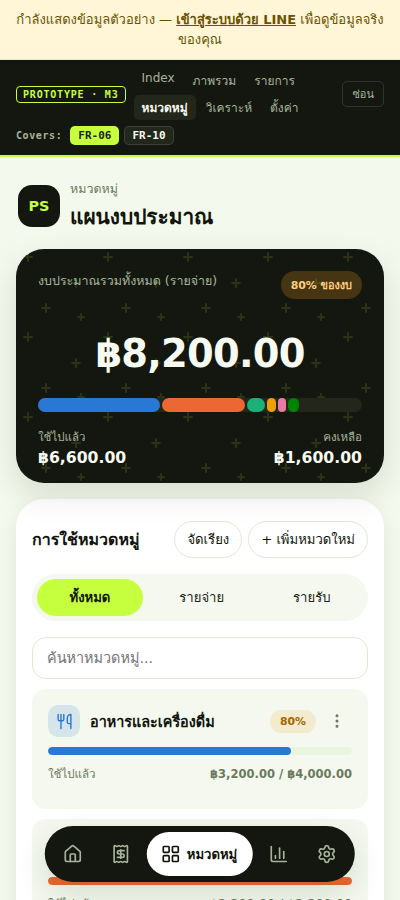
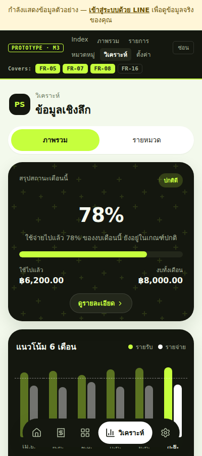
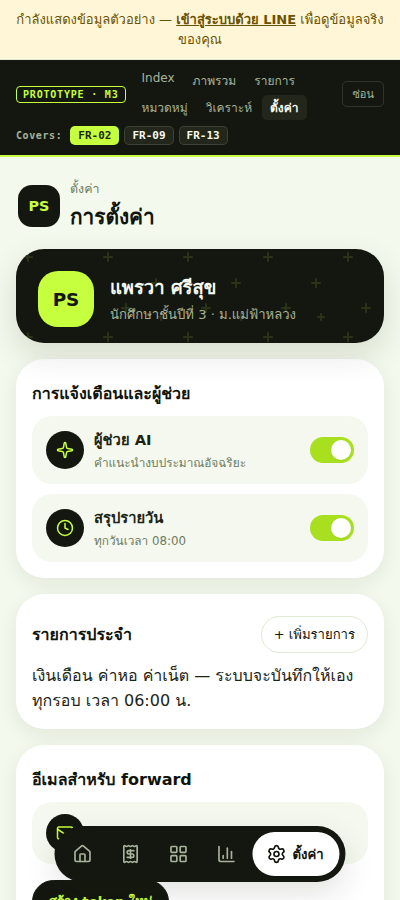

# Final Project Report — JOD tang (จดตัง)

**Intro to Software Engineering — ปีการศึกษา 2569 — Milestone 3 (Final Project)**

---

## §1 หน้าปก

| | |
|---|---|
| **ชื่อโปรเจกต์** | **JOD tang (จดตัง)** — ผู้ช่วยจดเงินและวางแผนออมผ่าน LINE |
| **ประโยคเดียวที่อธิบายทั้งโปรเจกต์** | จดรายจ่ายด้วยการพิมพ์ 1 ข้อความ แล้วระบบตอบได้ว่า *"วันนี้ใช้ได้อีกเท่าไหร่"* และ *"อยากได้ของชิ้นนี้ ต้องออมเดือนละเท่าไหร่"* |
| **GitHub Repo** | https://github.com/6931503045-design/Lumen_line |
| **Demo (ใช้งานได้จริง)** | https://lumen-line.onrender.com |
| **สารบัญหน้าจอ Prototype** | https://lumen-line.onrender.com/prototype.html |

### สมาชิกในทีม

> ⬜ **ทีมกรอกชื่อ-นามสกุลตรงนี้ก่อนส่ง** — ส่วน GitHub account และคะแนนส่วนร่วมดูได้จาก §8

| # | ชื่อ–นามสกุล | รหัสนักศึกษา | GitHub | บทบาทหลัก |
|---|---|---|---|---|
| 1 | ⬜ | 6931503045 | `6931503045-design` | เจ้าของ repo · เอกสาร · SPEC |
| 2 | ⬜ | 6931503088 | `88coder-1` | Frontend · UI/UX · LINE integration |
| 3 | ⬜ | ⬜ | `BeginPython01` | โครงสร้างโปรเจกต์เริ่มต้น · service layer |
| 4 | ⬜ | ⬜ | ⬜ | ⬜ |
| 5 | ⬜ | ⬜ | ⬜ | ⬜ |

---

## §2 ปัญหา & ผู้ใช้

> อ้างอิง: Team Charter (M1) · `docs/SRS.md` §1–§2

### ปัญหา

1. **จดแล้วเลิก** — แอปจดรายจ่ายทั่วไปต้องกรอกหลายขั้นตอน (เปิดแอป → เลือกหมวด → พิมพ์ยอด → บันทึก)
   ผู้ใช้เลิกจดภายใน 2–3 สัปดาห์ ข้อมูลจึงไม่เคยครบพอจะเอาไปใช้ตัดสินใจ
2. **รู้แค่ว่าเงินหายไปไหน** — แอปบอกยอดย้อนหลังได้ แต่ไม่ตอบคำถามที่ผู้ใช้อยากรู้จริง ๆ
   คือ *"ตอนนี้ใช้ได้อีกเท่าไหร่โดยไม่พัง"* และ *"เป้าหมายที่อยากได้ ทำได้จริงไหม"*

### ผู้ใช้

**นักศึกษามหาวิทยาลัย อายุ 18–24 ปี ที่มีเงินจำกัดต่อเดือน**

| | |
|---|---|
| รายได้ | เงินจากผู้ปกครองเป็นก้อน/เดือน + งานพาร์ทไทม์บ้าง |
| พฤติกรรม | ใช้ LINE ทุกวัน · จ่ายเงินผ่าน K PLUS · ไม่เปิดแอปการเงินแยก |
| ความเจ็บปวด | สิ้นเดือนเงินหมดโดยไม่รู้ว่าหมดไปกับอะไร · อยากได้ของแต่ไม่รู้ว่าเก็บไหวไหม |

### ทำไมต้องเป็น LINE

ผู้ใช้เปิด LINE อยู่แล้วทั้งวัน — จดได้ใน **1 ข้อความ ≤ 3 วินาที** โดยไม่ต้องเปิดแอปใหม่
นี่คือคำตอบตรง ๆ ของปัญหาข้อ 1 ส่วนงานที่ต้องใช้จอเต็ม (กราฟ ตั้งงบ จัดการหมวด) อยู่บนหน้าเว็บใน LINE (LIFF)
ทั้งสองช่องทางใช้ **backend เดียว ฐานข้อมูลเดียว ตัวตนเดียว** (`line_user_id`)

---

## §3 สรุป Requirements

> ฉบับเต็มพร้อมเกณฑ์ยอมรับทุกข้อ: **`docs/SRS.md`**

### Functional Requirements — Must (MVP)

| ID | Requirement | Priority |
|---|---|---|
| **FR-01** | ผู้ใช้พิมพ์ข้อความสั้นใน LINE แล้วระบบบันทึกเป็นรายการพร้อมหมวดทันที | **Must** |
| **FR-02** | อีเมลธนาคารที่ forward เข้ามาถูกแปลงเป็นรายการอัตโนมัติ | **Must** |
| **FR-03** | ผู้ใช้เพิ่ม แก้ไข และลบรายการเงินได้จากหน้าเว็บ | **Must** |
| **FR-04** | ผู้ใช้ดูยอดคงเหลือ รายรับ รายจ่าย รายการล่าสุด และกราฟรายหมวดได้ | **Must** |
| **FR-05** | ระบบบอกว่า **"วันนี้ใช้ได้อีกวันละเท่าไหร่"** | **Must · MVP** |
| **FR-06** | ผู้ใช้ตั้งงบรายเดือนต่อหมวด และระบบเตือนเมื่อใช้ถึง 80% และ 100% | **Must** |
| **FR-07** | ระบบเสนอ **แผนออม 3 ทางเลือก** พร้อมยอดออม/เดือนและระดับความมั่นใจ | **Must · MVP** |
| **FR-08** | ผู้ใช้โอนเงินเข้าแผนได้ และถูกเตือนเมื่อหลุดเป้าหรือครบเป้า | **Must** |

### Should / Could (ย่อ)

| ระดับ | รายการ |
|---|---|
| **Should** | FR-09 รายการประจำ · FR-10 จัดการหมวดหมู่ · FR-11 คำสั่งข้อความใน LINE · FR-12 push + โควตา · FR-13 rotate email token · FR-14 AI ช่วยตีความข้อความ |
| **Could** | FR-15 อ่านสลิป · FR-16 จำลองก่อนซื้อ · FR-17 สรุปรายวัน · FR-18 Rich Menu · FR-19 กราฟ 6 เดือน · FR-20 กันรายการซ้ำ |

> 📌 **FR-14 (AI) เป็น Should ไม่ใช่ Must** — เพราะกฎเหล็ก **G4** ของโปรเจกต์บังคับว่า *ปิด AI แล้วแอปต้องยังใช้ได้*
> สิ่งที่ตัดออกได้โดยระบบยังทำงาน ตามนิยามแล้วไม่ใช่ MVP (เหตุผลเต็มใน `docs/SRS.md` §4.3)

### Non-Functional Requirements (วัดได้ทุกข้อ)

| ID | Requirement | ค่าที่ต้องได้ |
|---|---|---|
| NFR-01 | ปิด AI แล้วระบบยังใช้ได้ | Must FR **8/8** ทำงานเมื่อ `AI_ENABLED=false` |
| NFR-02 | ความแม่นยำของจำนวนเงิน | คลาดเคลื่อน **0 สตางค์** — ไม่มี float |
| NFR-03 | แรงเสียดทานในการจด | ≤ **1 ข้อความ** และ ≤ **3 วินาที** |
| NFR-04 | ความหน่วงของอีเมลธนาคาร | ≤ **5 นาที** |
| NFR-05 | โควตา push ของ LINE | ≤ **280 ครั้ง/เดือน/คน** |
| NFR-06 | ผลลัพธ์คงเส้นคงวา | เรียกซ้ำข้อมูลเดิม ได้ผลเดิม **100%** |
| NFR-07 | ไม่นับรายการซ้ำ | 2 ช่องทางใน **30 นาที** นับ **1 ครั้ง** |
| NFR-08 | แยกข้อมูลระหว่างผู้ใช้ | **0 endpoint** ที่ไม่กรอง `user_id` |
| NFR-09 | เพดานต่อรายการ | ≤ **10,000,000 บาท** |
| NFR-10 | ความลับ | **0 secret** ใน repo |
| NFR-11 | ความครอบคลุมการทดสอบ | **433 tests ผ่าน 433** |

---

## §4 การออกแบบ

> อ้างอิงเต็ม: `SPEC.md` §2 (สถาปัตยกรรม) · §S6 (ฐานข้อมูล)

### 4.1 สถาปัตยกรรมระบบ

```
┌──────────────┐                         ┌──────────────────┐
│  LINE App    │                         │ LIFF (หน้าเว็บ)   │
└──────┬───────┘                         └────────┬─────────┘
       │ webhook (มีลายเซ็น)                       │ REST + session cookie
       ▼                                          ▼
┌─────────────────────┐              ┌──────────────────────┐
│ S1 LINE Gateway     │              │ S3 Core API          │
└──────┬──────────────┘              └──────────┬───────────┘
       │                                        │
       ▼                                        │
┌─────────────────────┐   เฉพาะที่ regex ไม่ไหว  ┌──────────────────────┐
│ S4 Text Parser      │──────────────────────►│ S11 AI Service       │
│ regex + พจนานุกรม    │                       │ Guard → Gemini → Zod │
└──────┬──────────────┘                       └──────────────────────┘
       ▼
┌──────────────────────┐
│ S12 Pending Actions  │  ⚖️ G2 AI แตะข้อมูลต้องให้คนกดยืนยันก่อน
└──────┬───────────────┘
       ▼
┌──────────────────────┐    ┌──────────────────┐    ┌─────────────────┐
│ S5 Money Engine      │◄──►│ S6 Supabase      │◄───┤ S8 Email Ingest │
│ 🔴 ห้ามมี AI          │    │ (PostgreSQL)     │    │ IMAP + DKIM     │
└──────────────────────┘    └──────▲───────────┘    └─────────────────┘
                                   │
                          ┌────────┴─────────┐     ┌─────────────────┐
                          │ S7 Scheduler     │────►│ S13 Push+Quota  │
                          │ GitHub Actions   │     └─────────────────┘
                          └──────────────────┘
```

**การตัดสินใจสำคัญ: แยก Money Engine ออกจาก AI Service เป็นคนละโมดูล**
AI เรียก Money Engine ได้ แต่ Money Engine ไม่รู้จัก AI เลย — ทำให้ **G1** (AI ไม่คำนวณเงิน)
และ **G4** (ปิด AI แล้วยังใช้ได้) เป็นจริงโดยโครงสร้าง ไม่ใช่โดยวินัยของคนเขียนโค้ด

### 4.2 Use Case Diagram

```
                        ┌─────────────────────────────────────────┐
                        │            JOD tang                     │
   ┌──────────┐         │                                         │
   │          │────────►│  จดรายการจากข้อความ        (FR-01)       │
   │          │────────►│  ดูสรุป + กราฟ             (FR-04)       │
   │  ผู้ใช้   │────────►│  แก้ไข / ลบ รายการ         (FR-03)       │
   │ (นักศึกษา)│────────►│  ดูเงินที่ใช้ได้ต่อวัน       (FR-05)       │
   │          │────────►│  ตั้งงบรายหมวด             (FR-06)       │
   │          │────────►│  สร้างแผนออม               (FR-07)       │
   │          │────────►│  โอนเข้าแผน                (FR-08)       │
   └──────────┘         │                                         │
                        │        ▲                 ▲              │
   ┌──────────┐         │        │ «include»       │ «include»    │
   │ ธนาคาร    │────────►│  รับอีเมลแจ้งเตือน  (FR-02)              │
   │ (K PLUS) │         │        │                 │              │
   └──────────┘         │  ┌─────┴──────┐   ┌──────┴───────┐      │
                        │  │ ตรวจ DKIM  │   │ กันรายการซ้ำ  │      │
   ┌──────────┐         │  └────────────┘   └──────────────┘      │
   │          │────────►│  สร้างรายการประจำตามรอบ    (FR-09)       │
   │ Scheduler│────────►│  ตรวจสถานะแผน              (FR-08)       │
   │ (ระบบ)   │────────►│  ส่งแจ้งเตือน + คุมโควตา    (FR-12)       │
   └──────────┘         └─────────────────────────────────────────┘
```

### 4.3 Sequence Diagram — FR-01 (จดรายการจากข้อความแชท)

```
ผู้ใช้        LINE        S1 Gateway      S4 Parser     S5 Money Engine    S6 DB
 │            │               │               │               │             │
 │ "กาแฟ 80"  │               │               │               │             │
 ├───────────►│               │               │               │             │
 │            │  webhook      │               │               │             │
 │            ├──────────────►│               │               │             │
 │            │               │ ① ตรวจลายเซ็น  │               │             │
 │            │               │ ② กัน event ซ้ำ│               │             │
 │            │               ├──────────────►│               │             │
 │            │               │               │ regex:        │             │
 │            │               │               │ "กาแฟ" + 80   │             │
 │            │               │               │ → 8000 สตางค์ │             │
 │            │               │               │   หมวด อาหาร  │             │
 │            │               │◄──────────────┤               │             │
 │            │               │  ⚖️ G3 ตรวจยอด: จำนวนเต็ม > 0 │             │
 │            │               ├──────────────────────────────►│             │
 │            │               │                               │ INSERT      │
 │            │               │                               │ ⚖️ G6 +user_id
 │            │               │                               ├────────────►│
 │            │               │                               │◄────────────┤
 │            │               │                  ③ เช็คงบหมวดนี้ถึง 80%? (FR-06)
 │            │               │◄──────────────────────────────┤             │
 │            │  reply +      │                               │             │
 │            │  ปุ่ม ↩️ ยกเลิก │                               │             │
 │            │◄──────────────┤                               │             │
 │◄───────────┤               │                               │             │
 │  "บันทึกแล้ว ฿80.00 · อาหาร"                                │             │
```

> **จุดที่ออกแบบไว้ตั้งใจ:** การเตือนงบ (③) ถูกแนบไปใน reply เดียวกัน **ไม่ใช่ส่ง push แยก**
> เพราะ reply ไม่กินโควตา 280 ครั้ง/เดือน (NFR-05) — ออกแบบตามข้อจำกัดของ LINE ตั้งแต่แรก

### 4.4 Data Model (ย่อ — เฉพาะตารางที่ MVP ใช้)

```
users ──┬──< categories ──┬──< transactions >── (self ref: dedup)
        │                 │
        │                 └──< budgets          (unique: user+category+month)
        │
        ├──< plans ────────< transactions       (type='transfer', ⚖️ G7)
        │
        ├──< recurring_rules
        └──< email_ingest_token
```

| ตาราง | ฟิลด์สำคัญ | หมายเหตุการออกแบบ |
|---|---|---|
| `users` | `line_user_id` (unique) · `email_ingest_token` | ตัวตนเดียวใช้ทั้งแชทและเว็บ |
| `categories` | `user_id` · `name` · `type` · `is_essential` | unique(user, name, type) — กันหมวดซ้ำ |
| `transactions` | `amount numeric(12,2)` · `type` · `occurred_at` · `deleted_at` | ลบแบบ soft delete · `type` มี `transfer` ด้วย (⚖️ G7) |
| `budgets` | `limit_amount` · `alerted_80` · `alerted_100` | ธงเตือนอยู่ที่ระดับ DB — กันเตือนซ้ำแม้มี request พร้อมกัน |
| `plans` | `target_amount` · `monthly_save` · `status` · `confidence` | `status='draft'` จนกว่าผู้ใช้จะกดยืนยัน (⚖️ G2) |

**ทั้ง 12 ตารางเปิด Row Level Security โดยไม่มี policy** → เข้าถึงได้เฉพาะ `service_role`
การกรอง `user_id` จึงเป็นหน้าที่ของ backend **100%** (NFR-08)

### 4.5 UI / Design System

| | |
|---|---|
| หน้าจอ | 5 หน้า — ภาพรวม · รายการ · หมวดหมู่ · วิเคราะห์ · ตั้งค่า |
| สี | เขียวอ่อนเป็นพื้น (`--bg`) · การ์ดขาว · การ์ดดำ accent · เขียวมะนาวเป็นจุดเน้น |
| ฟอนต์ | Noto Sans Thai (ไทย) + Noto Sans (ตัวเลข/ละติน) |
| หลักการ | ไม่มี blur/backdrop-filter เลย — ตัดสินใจร่วมกันเรื่อง performance บนมือถือ |
| Token | ทุกสี/ระยะ/มุมโค้งเป็น CSS custom property ที่ `:root` ใช้ซ้ำทั้ง 5 หน้า + หน้าสารบัญ |

---

## §5 การทำ Prototype

### 5.1 เครื่องมือที่ใช้

| ส่วน | เครื่องมือ | เหตุผล |
|---|---|---|
| Prototype | **HTML / CSS / JavaScript ล้วน** | เปิดในเบราว์เซอร์ได้ทันที ไม่ต้อง build ไม่ต้องมี framework |
| กราฟ | Chart.js (CDN) | ไม่ต้องเขียน SVG เอง |
| Backend | Node.js + TypeScript + Express | |
| ฐานข้อมูล | Supabase (PostgreSQL) | |
| Deploy | Render | ให้ทีมและอาจารย์เปิดดูได้จาก URL เดียว |
| งานตามเวลา | GitHub Actions cron | ไม่ต้องเปิดเครื่องทิ้งไว้ |

### 5.2 ขอบเขต — Must FR ครบ 8/8

| FR | หน้าจอที่รองรับ |
|---|---|
| FR-01 จดจากข้อความแชท | แชท LINE (สาธิตสดตอน demo) |
| FR-02 จดจากอีเมลธนาคาร | อีเมล → แสดงผลที่ *รายการ* · ที่อยู่ forward ที่ *ตั้งค่า* |
| FR-03 เพิ่ม / แก้ / ลบ | *ภาพรวม* · *รายการ* |
| FR-04 สรุป + กราฟ | *ภาพรวม* · *รายการ* |
| FR-05 ใช้ได้วันละเท่าไหร่ | *ภาพรวม* · *วิเคราะห์* |
| FR-06 งบรายหมวด + เตือน | *หมวดหมู่* |
| FR-07 แผนออม 3 ทางเลือก | *วิเคราะห์* · *ภาพรวม* |
| FR-08 โอนเข้าแผน + ติดตาม | *วิเคราะห์* |

**ทุกหน้ามีแถบดำบนสุดบอกว่าหน้านั้น `Covers:` requirement ข้อไหน**
และมีหน้าสารบัญ `prototype.html` ที่จัดหน้าจอตาม user journey 5 เส้นทาง

### 5.3 Screenshots

| | |
|---|---|
| **สารบัญหน้าจอ** — จัดตาม user journey พร้อมตารางตรวจความครอบคลุม Must FR |  |
| **ภาพรวม** — `Covers: FR-04 FR-05 FR-03 FR-07` · ยอดใช้ได้ต่อวัน · งบรายเดือน |  |
| **รายการ** — `Covers: FR-04 FR-03 FR-02` · ค้นหา กรอง แก้ไข ลบ |  |
| **หมวดหมู่** — `Covers: FR-06 FR-10` · ตั้งงบ + แถบเตือน 80/100% |  |
| **วิเคราะห์** — `Covers: FR-05 FR-07 FR-08 FR-16` · แผนออม + ความมั่นใจ |  |
| **ตั้งค่า** — `Covers: FR-02 FR-09 FR-13` · อีเมล forward + รายการประจำ |  |

### 5.4 เกินจากที่เกณฑ์ขอ

เกณฑ์ระบุว่า prototype *"ไม่ต้องผูก backend/DB จริง"* แต่ของทีมนี้**ต่อของจริงทั้งเส้น**:

- LINE bot จดเงินจากแชทได้จริง
- อีเมล K PLUS เข้าระบบเอง — **ทดสอบกับเงินจริงสำเร็จแล้ว**
- ฐานข้อมูล Supabase 12 ตาราง · งานตามเวลา 4 ตัวทำงานอยู่
- **433 unit tests** · deploy อยู่จริงที่ Render

ถึงอย่างนั้นก็ยัง**เปิดคลิกดูได้โดยไม่ต้องล็อกอิน** — จะเห็นข้อมูลตัวอย่างพร้อมแถบแจ้งเตือน
ตรงตามเกณฑ์ข้อ *"เปิดดูได้ในเบราว์เซอร์ ไม่ต้องมี server"*

---

## §6 การทดสอบ

### 6.1 ภาพรวม

| | |
|---|---|
| จำนวนเทสต์ | **433 ผ่าน 433** · 22 ไฟล์ |
| เครื่องมือ | Vitest |
| คำสั่ง | `npm test` |
| หลักการ | ทดสอบ **"ตัดสินใจถูกไหม"** ไม่ใช่ **"ต่อ DB ติดไหม"** — ชั้น query ถูก mock ทิ้ง |

### 6.2 ตาราง Scenario ตาม Acceptance Criteria

> ตัวอย่างจาก Must FR — ฉบับเต็มทุกข้ออยู่ใน `docs/SRS.md` §6

#### FR-05 — ใช้ได้วันละเท่าไหร่

| Scenario | คาดหวัง | ผล |
|---|---|---|
| คงเหลือ 3,000 บาท · เหลือ 10 วัน | 300 บาท/วัน | ✅ ผ่าน |
| มีแผนออม active 1,000/เดือน | หัก 1,000 ก่อนหาร | ✅ ผ่าน |
| วันสุดท้ายของเดือน | หารด้วย 1 ไม่ใช่หารด้วย 0 | ✅ ผ่าน |
| **คงเหลือติดลบ (ทางที่ผิด)** | เตือนว่าใช้เกินเท่าไหร่ ไม่โชว์เลขติดลบเป็นยอดใช้ได้ | ✅ ผ่าน |
| **ข้อมูล < 7 วัน (ทางที่ผิด)** | ติดป้ายความมั่นใจต่ำ ไม่ตอบตัวเลขลอย ๆ | ✅ ผ่าน |

#### FR-06 — งบรายหมวด

| Scenario | คาดหวัง | ผล |
|---|---|---|
| ตั้งงบ 3,000 · ใช้ 2,400 | เตือน 80% ครั้งเดียว | ✅ ผ่าน |
| ใช้ต่อจนครบ 3,000 | เตือน 100% ครั้งเดียว | ✅ ผ่าน |
| **ใช้ 79.99966% (ทางที่ผิด)** | **ยังไม่เตือน** ต้องไม่ปัดขึ้นเป็น 80% | ✅ ผ่าน |
| **ตั้งงบให้หมวดของคนอื่น (ทางที่ผิด)** | 404 ไม่พบ | ✅ ผ่าน |

#### FR-02 — อีเมลธนาคาร

| Scenario | คาดหวัง | ผล |
|---|---|---|
| อีเมล K PLUS แจ้งเงินออก 131.00 บาท | สร้างรายจ่าย 131.00 ภายใน 5 นาที | ✅ ผ่าน (เงินจริง) |
| อีเมลผ่านการ forward จาก Gmail | DKIM ยังตรวจผ่าน | ✅ ผ่าน |
| **DKIM ไม่ผ่าน (ทางที่ผิด)** | ข้าม ไม่บันทึก — กันอีเมลปลอม | ✅ ผ่าน |
| **ดึงอีเมลฉบับเดิมซ้ำ (ทางที่ผิด)** | ไม่สร้างรายการซ้ำ | ✅ ผ่าน |

### 6.3 การทดสอบด้วยเบราว์เซอร์จริง

รัน Chromium แบบ headless เปิดทั้ง 6 หน้าที่ความกว้าง 400px:

```
✅ prototype · ภาพรวม · รายการ · หมวดหมู่ · วิเคราะห์ · ตั้งค่า
0 JS error · 0 console error · ไม่มีหน้าไหนเลื่อนแนวนอนได้
```

### 6.4 บั๊กที่การทดสอบจับได้ (ตัวอย่างที่เจ็บที่สุด)

| บั๊ก | ถ้าไม่เจอจะเกิดอะไร |
|---|---|
| เกณฑ์เตือนงบเทียบจาก % ที่ปัดแล้ว | 79.99966% ถูกปัดเป็น 80% → เตือนผิดจังหวะ และ**เผาสิทธิ์เตือนของทั้งเดือนทิ้ง** |
| `POST /api/transactions` ไม่ส่ง `categoryName` แล้ว 400 | สร้างรายการจากหน้าเว็บไม่ได้เลย **ตั้งแต่วันแรก** |
| ปุ่มบันทึกบนเว็บแก้แต่ข้อมูลในเบราว์เซอร์ | ขึ้นว่า "สำเร็จ" ทั้งที่เงินไม่ได้ถูกบันทึก — รีเฟรชแล้วหาย |
| `initializePage()` ถูกเรียก 2 รอบ | สวิตช์ในหน้าตั้งค่ากดแล้วเด้งกลับทันที (listener 2 ชุดหักล้างกัน) |
| รอบถัดไปของรายการรายเดือนยึดวันที่ถูกบีบ | 31 ม.ค. → 28 ก.พ. แล้ว**ค้างที่ 28 ตลอดไป** |

---

## §7 การใช้ AI (Reflection)

### 7.1 เราใช้ AI ตรงไหน

| ใช้ที่ไหน | ใช้อย่างไร |
|---|---|
| **เขียนโค้ด** | Claude Code ช่วยเขียน service layer, query, และเทสต์ ภายใต้กติกาใน `AIDO.md` |
| **ในตัวผลิตภัณฑ์** | Gemini ตีความข้อความที่ regex อ่านไม่ออก (FR-14) — **ยังไม่ได้เขียน** |
| **เอกสาร** | ช่วยเรียบเรียง SRS และรายงานจากวัตถุดิบที่ทีมเขียนไว้ใน SPEC |

ทีมเขียน **`AIDO.md` (750 บรรทัด)** เป็นคู่มือกำกับ AI ตั้งแต่ต้นโปรเจกต์
ระบุ **"เขตห้าม AI"** ไว้ชัดเจน — Money Engine (S5) และ Dedup (S10) ห้าม AI แตะเด็ดขาด

### 7.2 อะไรเวิร์ค

- **งานที่มีแบบแผนชัด** — เขียน query ที่ต้องกรอง `user_id` ทุกครั้ง, แปลงรูปแบบข้อมูล, เขียนเทสต์ตาม acceptance criteria ที่กำหนดไว้แล้ว
- **จับ edge case ที่คนมองข้าม** — เช่น 31 ม.ค. → 28 ก.พ. ของรายการรายเดือน, การหารด้วย 0 ในวันสุดท้ายของเดือน
- **เขียนคอมเมนต์อธิบาย "ทำไม" ไม่ใช่ "ทำอะไร"** — เวลากลับมาอ่านโค้ดอีกทีเข้าใจเหตุผลได้เร็ว
- **งานซ้ำ ๆ ที่น่าเบื่อแต่พลาดง่าย** — เช่นไล่แก้ `Number(id)` เป็น `String(id)` ทั้งไฟล์เมื่อ id เปลี่ยนจากเลขเป็น UUID

### 7.3 อะไรไม่เวิร์ค — ต้องแก้เอง

| ปัญหา | สิ่งที่เกิดขึ้นจริง |
|---|---|
| **AI สร้างโค้ดที่ "ดูถูก" แต่ผิดเรื่องเงิน** | เคยเทียบเกณฑ์เตือนงบจากเปอร์เซ็นต์ที่ปัดแล้ว อ่านผ่าน ๆ ดูไม่ออกเลย ต้องมีเทสต์เฉพาะเคส 79.99966% ถึงจับได้ |
| **เทสต์เขียวแต่ไฟล์ไม่ได้ถูกรัน** | เทสต์บางไฟล์ import พัง Vitest ข้ามไฟล์นั้นเงียบ ๆ แล้วยังขึ้น "passed" — จำนวนเทสต์ลดลงโดยไม่มีใครรู้ **2 ครั้ง** ต้องเพิ่ม `tests/setup.ts` แก้ที่ต้นเหตุ |
| **AI เดาสาเหตุผิดแล้วพูดอย่างมั่นใจ** | ครั้งหนึ่งสรุปว่ารายการหายเพราะ user_id ไม่ตรง แต่พอเช็ค API จริงพบว่าข้อมูลอยู่ครบ สมมติฐานผิดทั้งหมด |
| **AI ไม่รู้ข้อจำกัดของบริการภายนอก** | Gmail ตัด `+token` ออกจาก `Delivered-To` ตอน forward — ไม่มีทางรู้จนกว่าจะยิงอีเมลจริงแล้วดู log |
| **ต้องบอกบริบทเองทุกครั้ง** | ถ้าไม่ชี้ไปที่ `SPEC.md` กับ `AIDO.md` AI จะเสนอวิธีที่ขัดกฎเหล็ก เช่น ให้ AI คำนวณยอดเงิน |

### 7.4 บทเรียน

1. **กฎต้องเขียนเป็นเอกสารก่อน ไม่ใช่เตือนเป็นครั้ง ๆ** — `AIDO.md` กับกฎเหล็ก 7 ข้อทำให้ไม่ต้องย้ำเรื่องเดิมซ้ำ
2. **AI เร่งการเขียนโค้ดได้ แต่ไม่ได้เร่งการ "รู้ว่าถูก"** — เทสต์ 433 ข้อคือสิ่งที่ทำให้กล้าแก้โค้ด ไม่ใช่ความมั่นใจของ AI
3. **แยกส่วนที่ AI ห้ามแตะออกมาเป็นโมดูลจริง ๆ** — การออกแบบให้ Money Engine ไม่รู้จัก AI เลย ทำให้กฎบังคับใช้ได้เองโดยไม่ต้องอาศัยวินัย
4. **ทดสอบกับของจริงเสมอ** — บั๊ก `+token` ของ Gmail ไม่มีทางเจอจาก unit test เพราะ fixture ไม่มี header

---

## §8 ส่วนร่วมของสมาชิก

> ⚖️ วัดจาก **GitHub contribution** ตามที่เกณฑ์กำหนด — ทุกคนเปิดดูของตัวเองได้ที่
> https://github.com/6931503045-design/Lumen_line/graphs/contributors

### 8.1 สถิติ commit (ทุก branch)

| GitHub account | commits | ช่วงเวลา | งานหลัก |
|---|---|---|---|
| `88coder-1` (6931503088) | **21** | 11–23 ก.ย. | UI ทั้ง 5 หน้า · `style.css` · `app.js` · เชื่อม LINE + ฐานข้อมูล · Flex message |
| `6931503045-design` (6931503045) | **11** | 11–22 ก.ย. | เจ้าของ repo · `SPEC.md` · `AIDO.md` · `README.md` · `Prompt_AI_Agent_v3.md` |
| `BeginPython01` | **4** | 11–13 ก.ย. | โครงสร้างโปรเจกต์เริ่มต้น · `tsconfig.json` · service layer ชุดแรก |
| ⬜ สมาชิกคนที่ 4 | ⬜ | ⬜ | ⬜ |
| ⬜ สมาชิกคนที่ 5 | ⬜ | ⬜ | ⬜ |

### 8.2 ⚠️ หมายเหตุสำคัญเรื่องการนับ commit

`git shortlog` แสดงว่ามี **39 commits ที่ author เป็น `Claude <noreply@anthropic.com>`**
ซึ่งเป็นผลจากการใช้ Claude Code เขียนโค้ดตามที่สมาชิกกำกับ **ไม่ใช่ commit ที่ไม่มีคนรับผิดชอบ**

> ⬜ **ทีมต้องกรอกตรงนี้ก่อนส่ง:** สมาชิกคนใดเป็นผู้สั่งงานและ review commit ชุดนี้
> เพื่อให้เห็นว่างานส่วนนี้เป็นของใคร ไม่งั้นคะแนนส่วนร่วมรายคนอาจถูกตีความผิด

| ช่วง commit | เนื้องาน | ผู้กำกับ/review |
|---|---|---|
| 14–18 ก.ย. (39 commits) | Money Engine (S5) · Email Ingestion (S8) · Scheduler (S7) · Push & Quota (S13) · เทสต์ 433 ข้อ | ⬜ |

### 8.3 งานที่ไม่ใช่โค้ดและอยู่ใน repo แล้ว

เกณฑ์ระบุว่างานที่ไม่ใช่โค้ด (design, doc, PM, test) ต้อง **ชี้ได้ใน repo** — ของทีมนี้อยู่ครบ:

| งาน | ไฟล์ |
|---|---|
| SRS + เกณฑ์ยอมรับ + Golden Thread | `docs/SRS.md` |
| สถาปัตยกรรมและข้อกำหนดโมดูล | `SPEC.md` (1,117 บรรทัด) |
| กฎเหล็ก 7 ข้อ | `docs/RULES.md` |
| คู่มือกำกับ AI | `AIDO.md` (750 บรรทัด) |
| สัญญา API ↔ หน้าเว็บ | `docs/UI_CONTRACT.md` |
| คู่มือตั้งค่าอีเมล | `docs/EMAIL_SETUP.md` |
| คู่มือ deploy | `docs/DEPLOY.md` |
| แผนงานที่เหลือ | `docs/ROADMAP.md` |
| รายงานฉบับนี้ | `docs/FINAL_REPORT.md` |
| Screenshots | `docs/screenshots/` |

---

## §9 Golden Thread Trace Table

> ตารางนี้พิสูจน์ว่า **ปัญหา → requirement → design → feature → test** ผูกกันจริงทุกเส้น

| ปัญหา | → REQUIREMENT | → DESIGN | → FEATURE | → TEST |
|---|---|---|---|---|
| จดแล้วเลิก เพราะกรอกหลายขั้นตอน | **FR-01** จดจากข้อความเดียว | `S4 Text Parser` · sequence §4.3 | พิมพ์ `กาแฟ 80` ใน LINE | `regexParser.test.ts` `thaiNumber.test.ts` ✓ |
| จดไม่ทัน เงินออกแล้วลืม | **FR-02** อีเมลธนาคารเข้าเอง | `S8 Email Ingestion` (IMAP + DKIM) | forward อีเมล K PLUS แล้วขึ้นเองใน 5 นาที | `kbankParser.test.ts` `emailDkim.test.ts` ✓ |
| ระบบอ่านผิดแล้วแก้ไม่ได้ | **FR-03** เพิ่ม/แก้/ลบ | `S3 Core API` · soft delete | ปุ่มแก้ไข/ลบในหน้ารายการ | `transaction.service.test.ts` ✓ |
| ไม่รู้ว่าเงินไปไหน | **FR-04** สรุป + กราฟ | `S5.1` + `S2 Frontend` | การ์ดยอดคงเหลือ + กราฟโดนัท | `summary.service.test.ts` ✓ |
| **"วันนี้ใช้ได้อีกเท่าไหร่?"** | **FR-05** safe-to-spend | `S5.2` 🔴 ห้ามมี AI · หาร D วันที่เหลือ | การ์ด "ใช้อย่างปลอดภัยได้" + คำสั่ง `เหลือ` | `safeToSpend.test.ts` ✓ |
| ใช้เกินงบจนสิ้นเดือนถึงรู้ | **FR-06** เตือน 80% / 100% | `S5.8` + ธงใน `budgets` | แถบงบรายหมวด + เตือนใน LINE | `budget.service.test.ts` ✓ |
| **"อยากได้ของ ต้องเก็บยังไง?"** | **FR-07** แผนออม 3 ทางเลือก | `S5.3–S5.5` · safety ratio 0.8 | การ์ดแผนออม + ระดับความมั่นใจ | `plan.service.test.ts` ✓ |
| เก็บแล้วไม่รู้ว่ายังไหวไหม | **FR-08** ติดตาม + เตือนหลุดเป้า | `S5.6` + job `planCheck` | ปุ่มโอนเข้าแผน + แถบความคืบหน้า | `planTransfer.test.ts` `planCheck.service.test.ts` ✓ |
| กลัว AI จดเงินผิดแล้วไม่รู้ตัว | **G1 + G2** (ข้ามทุก FR) | Money Engine แยกจาก AI คนละโมดูล | ตัวเลขทุกบาทมาจากโค้ด · AI ต้องให้คนยืนยัน | `money.test.ts` `redact.test.ts` ✓ |

---

## §10 ลิงก์

| | |
|---|---|
| **GitHub Repo** | https://github.com/6931503045-design/Lumen_line |
| **Demo (เปิดคลิกได้เลย ไม่ต้องล็อกอิน)** | https://lumen-line.onrender.com |
| **สารบัญหน้าจอ Prototype** | https://lumen-line.onrender.com/prototype.html |
| **Contributors** | https://github.com/6931503045-design/Lumen_line/graphs/contributors |
| **วิดีโอ demo 2–3 นาที** | ⬜ (ถ้าทำ) |

### เอกสารประกอบใน repo

| เอกสาร | เนื้อหา |
|---|---|
| `docs/SRS.md` | Requirements ฉบับเต็ม + เกณฑ์ยอมรับทุกข้อ + Golden Thread |
| `SPEC.md` | สถาปัตยกรรม + ข้อกำหนดรายโมดูล S1–S13 |
| `docs/RULES.md` | กฎเหล็ก 7 ข้อ |
| `AIDO.md` | คู่มือกำกับ AI |
| `docs/UI_CONTRACT.md` | สัญญาระหว่าง API กับหน้าเว็บ |
| `docs/ROADMAP.md` | สถานะและงานที่เหลือ |

### วิธีรันในเครื่อง

```bash
git clone https://github.com/6931503045-design/Lumen_line.git
cd Lumen_line
npm install
cp .env.example .env     # กรอกค่า LINE / Supabase
npm test                 # 433 tests
npm run dev              # เปิดที่ http://localhost:3000
```

เปิด prototype โดยไม่ต้องมี server: เปิดไฟล์ `web/prototype.html` ในเบราว์เซอร์ได้เลย
